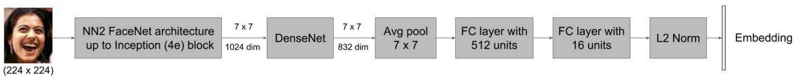
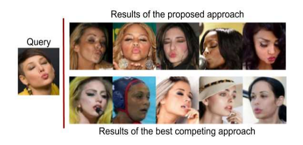

# FECNet

**Oct 23, 2022**
* Updated the image download script.



This module contains code in support of the paper [A Compact Embedding for Facial Expression Similarity](http://openaccess.thecvf.com/content_CVPR_2019/papers/Vemulapalli_A_Compact_Embedding_for_Facial_Expression_Similarity_CVPR_2019_paper.pdf). The experiment is implemented using the PyTorch framework.

In this repository, I used the implementation of Inception network from [timesler](https://github.com/timesler/facenet-pytorch) and DenseNet from [gpleiss](https://github.com/gpleiss/efficient_densenet_pytorch)
### Dependencies

The code was successfully built and run with these versions:

```
pytorch-gpu 1.2.0
cudnn 7.6.4
cudatoolkit 10.0.130
opencv 3.4.2

```

### Preprocessing Data

For preprocessing, you should download the [Google facial expression comparison dataset](https://ai.google/tools/datasets/google-facial-expression/) and extract in 'data' folder.
After that, you have to run the 'preprocess.py' file to download images and create the dataset.


### Training


I followed the procedure in the main paper to train their network. In this work, their goal is to describe facial expression in a continuous compact embedding space. The network has a backbone of [inception network](https://www.cv-foundation.org/openaccess/content_cvpr_2015/papers/Schroff_FaceNet_A_Unified_2015_CVPR_paper.pdf) (which was trained to cluster faces) up to inception (4) block. The inception network was trained on [VGGFace2](https://arxiv.org/abs/1710.08092). The weights of inception network is fixed and the output feature maps feed to a [DenseNet](https://www.cv-foundation.org/openaccess/content_cvpr_2015/papers/Szegedy_Going_Deeper_With_2015_CVPR_paper.pdf) consists of a regular convolution layer with 512 filters and 1\*1 kernel size. It also has a Dense block with 5 layers and growth rate of 64 (the whole parameters are based on the main paper). It follows by two fully connected layers with 512 and 16 embedding size.
For training, run the 'FECNet.py' file.

The following pretrained FECNet is available:


| model | pretraining | training | Traing acc | Test acc |
|-------|-------------|----------|--------------|---------------|
| inception_resnet_v1 | [VGGFace2](https://arxiv.org/abs/1710.08092) | Google facial expression comparison dataset | 75.0 | 64.3 |



You can download the pretrained model [here](https://drive.google.com/file/d/1iTG-aqh88HBWTWRNN_IAHEoS8J-ns0jx/view?usp=sharing)

### References

If you found this repo useful give me a star!

```
@inproceedings{vemulapalli2019compact,
  title={A Compact Embedding for Facial Expression Similarity},
  author={Vemulapalli, Raviteja and Agarwala, Aseem},
  booktitle={Conference on Computer Vision and Pattern Recognition (CVPR)},
  pages={5683--5692},
  year={2019}
}
```
